# 📦 Inventory Management System

> A production-grade, enterprise-ready **Inventory Management System** built with **Spring Boot 3.2**, **Java 17**, and **Clean Architecture** principles. The project demonstrates five GoF design patterns, comprehensive testing with 95%+ code coverage, and a fully automated CI/CD pipeline using **Jenkins** and **SonarQube**.

---

## 📑 Table of Contents

- [Overview](#-overview)
- [Tech Stack](#-tech-stack)
- [Architecture](#-architecture)
  - [High-Level Architecture](#high-level-architecture)
  - [Package Structure](#package-structure)
  - [Entity Relationship Diagram](#entity-relationship-diagram)
- [Design Patterns](#-design-patterns)
  - [1. Factory Pattern](#1-factory-pattern)
  - [2. Command Pattern](#2-command-pattern)
  - [3. Facade Pattern](#3-facade-pattern)
  - [4. Observer Pattern](#4-observer-pattern)
  - [5. Strategy Pattern](#5-strategy-pattern)
  - [How They Work Together](#how-they-work-together)
- [API Reference](#-api-reference)
- [Configuration](#-configuration)
  - [Application Configuration](#application-configuration-applicationyml)
  - [Build Configuration](#build-configuration-buildgradle)
  - [Docker Compose](#docker-compose-docker-composeyml)
- [CI/CD Pipeline](#-cicd-pipeline)
  - [Jenkins Pipeline](#jenkins-pipeline)
  - [SonarQube Integration](#sonarqube-integration)
  - [Pipeline Setup Guide](#pipeline-setup-guide)
- [Testing](#-testing)
- [Getting Started](#-getting-started)
- [Project Stats](#-project-stats)

---

## 🔍 Overview

The Inventory Management System provides a robust backend for managing:

| Feature | Description |
|---------|-------------|
| **Product Management** | CRUD operations for products with SKU, pricing, and category assignment |
| **Category Management** | Organize products into categories |
| **Stock Operations** | Stock-In and Stock-Out with warehouse tracking |
| **Low Stock Alerts** | Automatic alerts when stock falls below threshold |
| **Audit Logging** | Every stock operation is logged with full traceability |
| **Multi-Warehouse** | Support for multiple warehouses with per-warehouse stock tracking |

---

## 🛠 Tech Stack

| Layer | Technology |
|-------|-----------|
| **Language** | Java 17 |
| **Framework** | Spring Boot 3.2.2 |
| **ORM** | Spring Data JPA + Hibernate |
| **Database** | H2 (dev) / PostgreSQL (prod) |
| **Build Tool** | Gradle 8.x |
| **Mapping** | MapStruct 1.5.5 |
| **Boilerplate** | Lombok |
| **Validation** | Jakarta Bean Validation |
| **Testing** | JUnit 5.11, Mockito, Testcontainers |
| **Code Coverage** | JaCoCo |
| **Code Quality** | SonarQube 10.3 Community |
| **CI/CD** | Jenkins LTS (JDK 17) |
| **Containerization** | Docker Compose |

---

## 🏗 Architecture

### High-Level Architecture

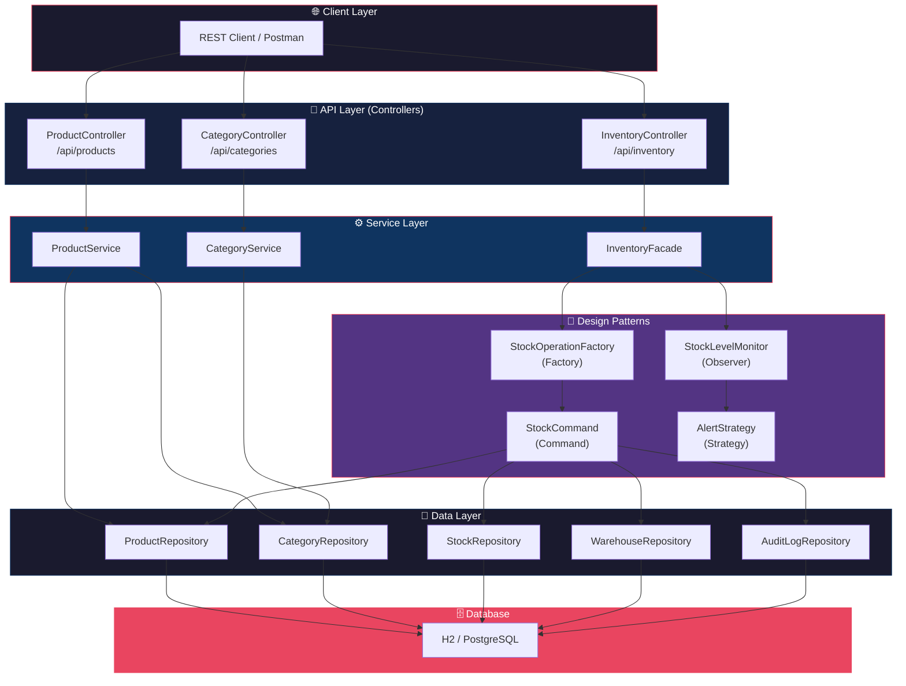

### Package Structure

```
src/main/java/com/inventory/system/
├── InventoryApplication.java          # Spring Boot entry point
├── config/
│   ├── DataLoader.java                # Seed data (Main Warehouse)
│   └── JpaConfig.java                 # Enables JPA Auditing
├── controller/
│   ├── CategoryController.java        # /api/categories endpoints
│   ├── InventoryController.java       # /api/inventory/operate endpoint
│   └── ProductController.java         # /api/products endpoints
├── dto/
│   ├── CategoryDTO.java               # Category transfer object
│   ├── ProductDTO.java                # Product transfer object
│   ├── StockDTO.java                  # Stock transfer object
│   └── StockOperationDTO.java         # Stock operation request
├── entity/
│   ├── BaseEntity.java                # Auditing fields (createdAt, updatedAt)
│   ├── AuditLog.java                  # Operation audit trail
│   ├── Category.java                  # Product categories
│   ├── Order.java                     # Purchase orders
│   ├── Product.java                   # Products with SKU & pricing
│   ├── Stock.java                     # Per-warehouse stock levels
│   └── Warehouse.java                 # Warehouse locations
├── exception/
│   └── GlobalExceptionHandler.java    # Centralized error handling
├── mapper/
│   ├── CategoryMapper.java            # MapStruct: Category ↔ DTO
│   ├── ProductMapper.java             # MapStruct: Product ↔ DTO
│   └── StockMapper.java               # MapStruct: Stock ↔ DTO
├── pattern/
│   ├── command/
│   │   ├── StockCommand.java          # Command interface
│   │   ├── StockInCommand.java        # Concrete: add stock
│   │   ├── StockOutCommand.java       # Concrete: remove stock
│   │   └── StockRepositoryContext.java # Repository context for commands
│   ├── facade/
│   │   └── InventoryFacade.java       # Unified stock operation API
│   ├── factory/
│   │   └── StockOperationFactory.java # Creates StockCommand instances
│   ├── observer/
│   │   ├── StockObserver.java         # Observer interface
│   │   └── StockLevelMonitor.java     # Monitors stock levels
│   └── strategy/
│       ├── AlertStrategy.java         # Strategy interface
│       ├── EmailAlertStrategy.java    # Email-based alerts
│       └── LogAlertStrategy.java      # Log-based alerts
├── repository/
│   ├── AuditLogRepository.java
│   ├── CategoryRepository.java
│   ├── OrderRepository.java
│   ├── ProductRepository.java
│   ├── StockRepository.java
│   └── WarehouseRepository.java
└── service/
    ├── CategoryService.java
    └── ProductService.java
```

### Entity Relationship Diagram

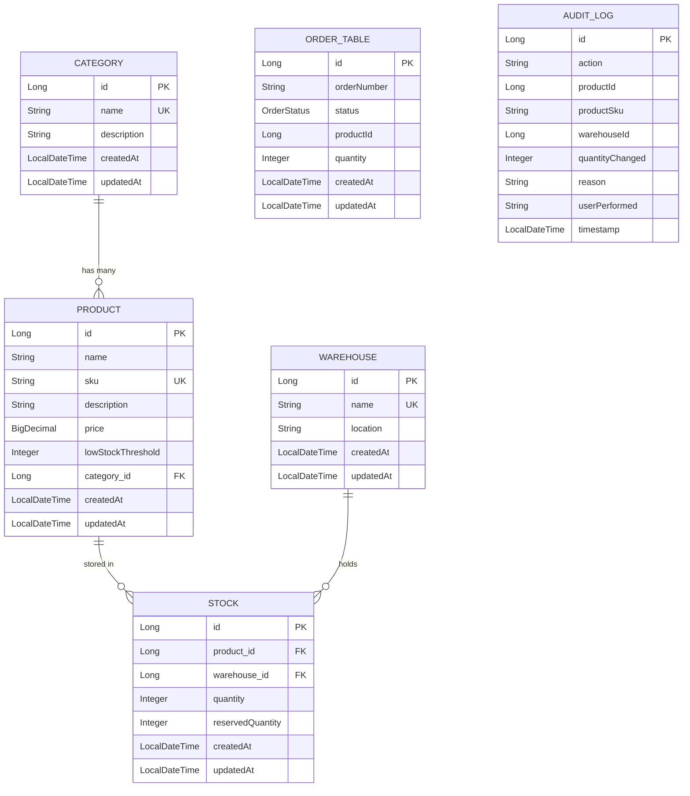

> **Key Relationships:**
> - A **Category** has many **Products** (one-to-many)
> - A **Product** has many **Stock** entries across warehouses (one-to-many)
> - A **Warehouse** holds many **Stock** entries (one-to-many)
> - **Stock** has a unique constraint on `(product_id, warehouse_id)` — one stock record per product per warehouse
> - **AuditLog** records every stock operation independently

---

## 🧩 Design Patterns

This project implements **five** GoF design patterns that work together to process stock operations:

### 1. Factory Pattern

> **Purpose:** Encapsulate object creation — decides *which* command to instantiate based on the operation type.

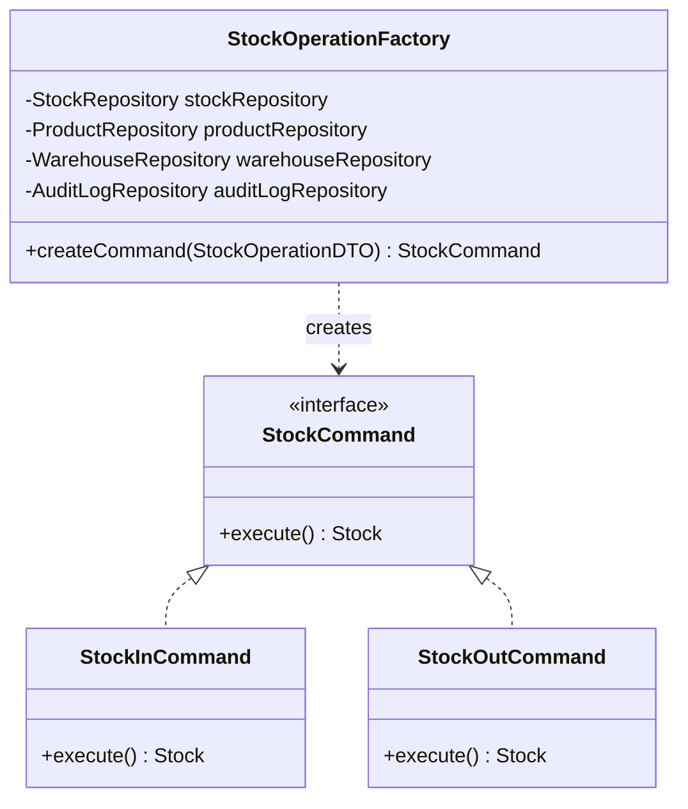

**How it works:**
```java
// StockOperationFactory.java
public StockCommand createCommand(StockOperationDTO dto) {
    if (dto.getType() == OperationType.IN) {
        return new StockInCommand(dto, context);
    } else if (dto.getType() == OperationType.OUT) {
        return new StockOutCommand(dto, context);
    }
    throw new IllegalArgumentException("Unknown operation type");
}
```

---

### 2. Command Pattern

> **Purpose:** Encapsulate each stock operation as an object, allowing parameterization and logging.

| Class | Role | Action |
|-------|------|--------|
| `StockCommand` | Interface | Defines `execute()` contract |
| `StockInCommand` | Concrete Command | Adds stock + creates audit log |
| `StockOutCommand` | Concrete Command | Removes stock (with validation) + creates audit log |
| `StockRepositoryContext` | Context | Bundles all needed repositories |

**StockInCommand flow:**
1. Fetch `Product` and `Warehouse` by ID
2. Find existing `Stock` record or create new one
3. Add quantity → `stock.setQuantity(current + incoming)`
4. Save stock and create `AuditLog` entry

**StockOutCommand flow:**
1. Find `Stock` by product + warehouse
2. **Validate** available quantity ≥ requested quantity
3. Subtract quantity → `stock.setQuantity(current - outgoing)`
4. Save stock and create `AuditLog` entry

---

### 3. Facade Pattern

> **Purpose:** Provide a simplified, unified interface that orchestrates the entire stock operation workflow.

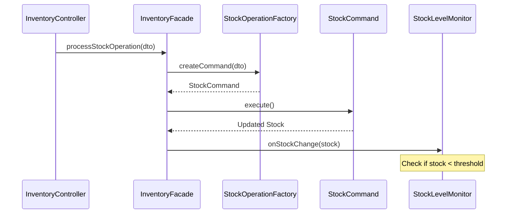

**Implementation:**
```java
// InventoryFacade.java
@Transactional
public void processStockOperation(StockOperationDTO operationDTO) {
    // 1. Create Command via Factory
    StockCommand command = stockOperationFactory.createCommand(operationDTO);
    // 2. Execute Command
    Stock updatedStock = command.execute();
    // 3. Trigger Observer (Monitor)
    stockLevelMonitor.onStockChange(updatedStock);
}
```

---

### 4. Observer Pattern

> **Purpose:** Automatically react to stock changes — when stock is updated, monitors are notified to check thresholds.

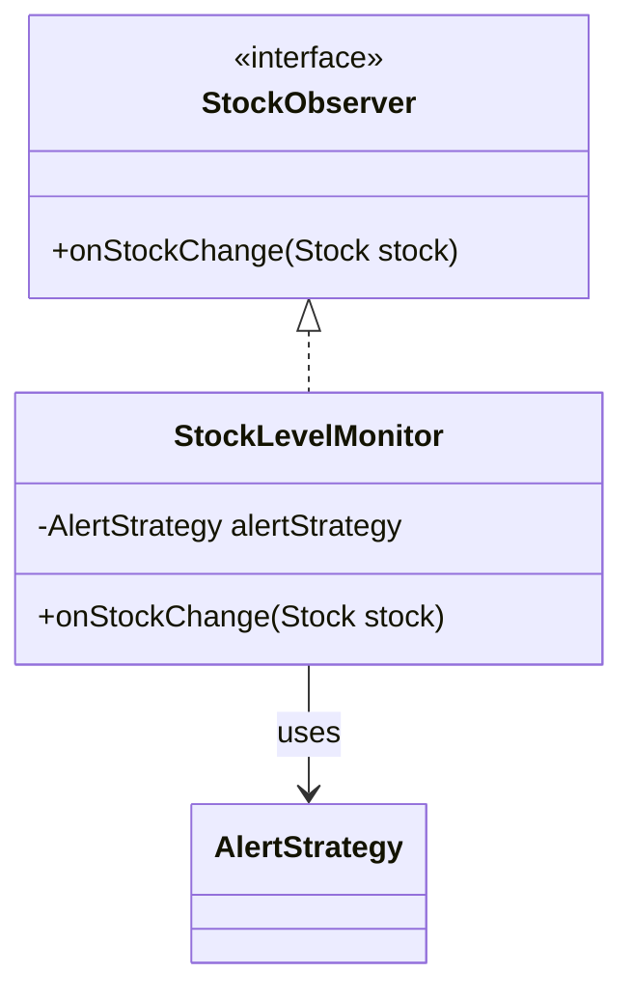

**Logic:** If `stock.quantity ≤ product.lowStockThreshold`, trigger the alert strategy.

---

### 5. Strategy Pattern

> **Purpose:** Allow switching the alert mechanism at runtime without changing the observer code.

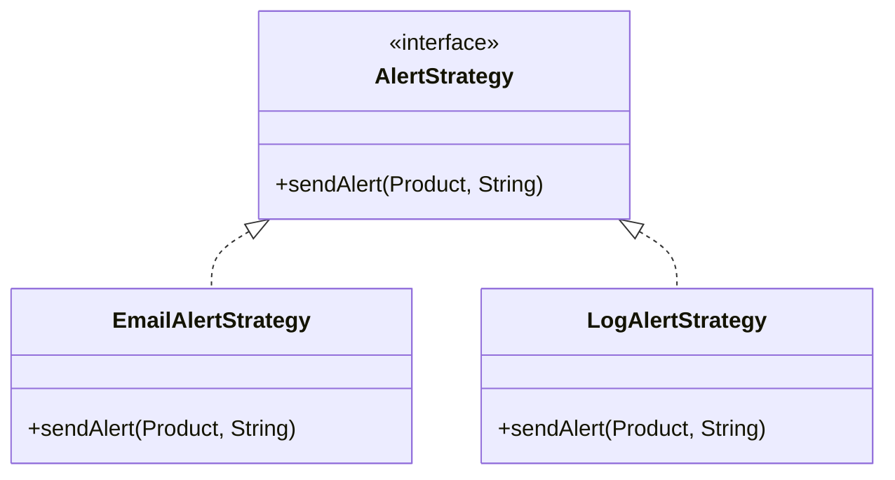

| Strategy | Bean Name | Behavior |
|----------|-----------|----------|
| `EmailAlertStrategy` | `emailAlertStrategy` | Simulates sending an SMTP email alert |
| `LogAlertStrategy` | `logAlertStrategy` | Logs a warning-level message |

The active strategy is selected via Spring's `@Qualifier` annotation in `StockLevelMonitor`.

---

### How They Work Together

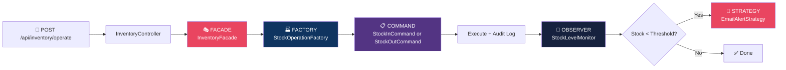

> **Complete flow:** A stock operation arrives via REST API → the **Facade** orchestrates the process → the **Factory** creates the right **Command** → the Command executes the operation → the **Observer** checks stock levels → if low, the **Strategy** sends an alert.

---

## 📡 API Reference

### Categories

| Method | Endpoint | Description |
|--------|----------|-------------|
| `POST` | `/api/categories` | Create a new category |
| `GET` | `/api/categories` | List all categories |

**Create Category:**
```json
POST /api/categories
{
  "name": "Electronics",
  "description": "Devices and gadgets"
}
```

---

### Products

| Method | Endpoint | Description |
|--------|----------|-------------|
| `POST` | `/api/products` | Create a new product |
| `GET` | `/api/products` | List all products |
| `GET` | `/api/products/{id}` | Get product by ID |

**Create Product:**
```json
POST /api/products
{
  "name": "Laptop",
  "sku": "LAP-001",
  "description": "High-end gaming laptop",
  "price": 1500.00,
  "lowStockThreshold": 10,
  "categoryId": 1
}
```

---

### Inventory Operations

| Method | Endpoint | Description |
|--------|----------|-------------|
| `POST` | `/api/inventory/operate` | Execute a stock-in or stock-out operation |

**Stock-In:**
```json
POST /api/inventory/operate
{
  "productId": 1,
  "warehouseId": 1,
  "quantity": 50,
  "type": "IN",
  "reason": "Initial stock"
}
```

**Stock-Out:**
```json
POST /api/inventory/operate
{
  "productId": 1,
  "warehouseId": 1,
  "quantity": 5,
  "type": "OUT",
  "reason": "Customer order #1001"
}
```

### Error Responses

All errors follow a consistent format:
```json
{
  "timestamp": "2026-02-17T00:00:00",
  "status": 404,
  "error": "Not Found",
  "message": "Product not found"
}
```

| Status | Exception | Meaning |
|--------|-----------|---------|
| `404` | `EntityNotFoundException` | Resource not found |
| `400` | `IllegalStateException` | Business rule violation (e.g., insufficient stock) |
| `400` | `IllegalArgumentException` | Invalid input (e.g., unknown operation type) |

---

## ⚙ Configuration

### Application Configuration (`application.yml`)

```yaml
spring:
  application:
    name: inventory-service       # Service name
server:
  port: 8081                      # Application runs on port 8081
  datasource:
    url: jdbc:h2:mem:inventorydb  # In-memory H2 database
    driverClassName: org.h2.Driver
    username: sa
    password: password
  jpa:
    database-platform: org.hibernate.dialect.H2Dialect
    hibernate:
      ddl-auto: update            # Auto-create/update schema
    show-sql: true                # SQL logging enabled
    properties:
      hibernate:
        format_sql: true          # Pretty-print SQL
  h2:
    console:
      enabled: true               # H2 web console enabled
      path: /h2-console           # Access at localhost:8081/h2-console
logging:
  level:
    com.inventory: DEBUG          # Debug logging for app code
    org.springframework.web: INFO # Info logging for Spring
```

> **Note:** The app uses H2 in-memory database by default. For production, PostgreSQL is available as a runtime dependency — just update the datasource configuration.

---

### Build Configuration (`build.gradle`)

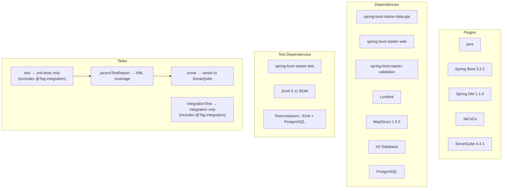

**Key Gradle configuration details:**

| Aspect | Configuration | Purpose |
|--------|--------------|---------|
| **Java version** | `sourceCompatibility = '17'` | Targets Java 17 |
| **Unit tests** | `excludeTags 'integration'` | `./gradlew test` runs unit tests only |
| **Integration tests** | `includeTags 'integration'` | `./gradlew integrationTest` runs integration tests |
| **JaCoCo** | `xml.required = true` | Generates XML report for SonarQube |
| **SonarQube** | `qualitygate.wait = false` | Build doesn't wait for quality gate locally |

---

### Docker Compose (`docker-compose.yml`)

The project includes a Docker Compose file to run the CI/CD infrastructure:

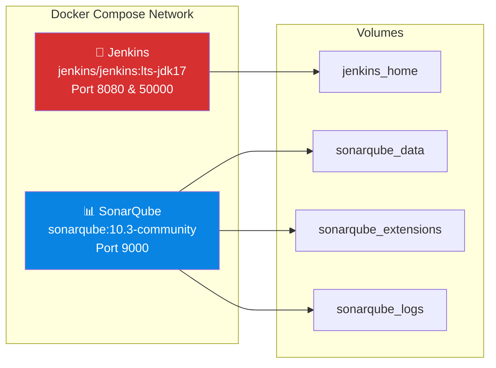

| Service | Image | Ports | Purpose |
|---------|-------|-------|---------|
| **Jenkins** | `jenkins/jenkins:lts-jdk17` | `8080` (UI), `50000` (agent) | CI/CD pipeline execution |
| **SonarQube** | `sonarqube:10.3-community` | `9000` | Static code analysis |

**Environment variables:**
- `SONAR_ES_BOOTSTRAP_CHECKS_DISABLE=true` — Disables Elasticsearch bootstrap checks for dev/local environments

**Persistent volumes** ensure data survives container restarts:
- `jenkins_home` — Jenkins configuration, jobs, plugins
- `sonarqube_data` — SonarQube project data and analysis results
- `sonarqube_extensions` — Installed SonarQube plugins
- `sonarqube_logs` — SonarQube log files

---

## 🚀 CI/CD Pipeline

### Jenkins Pipeline

The project uses a **Declarative Jenkins Pipeline** defined in `Jenkinsfile` with 6 stages:

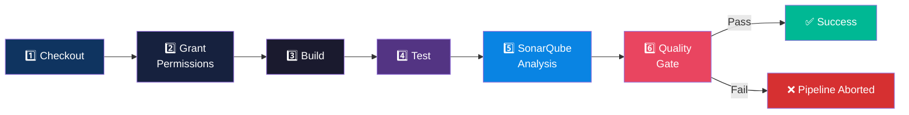

| Stage | Command | Description |
|-------|---------|-------------|
| **1. Checkout** | `checkout scm` | Clones the repository from SCM |
| **2. Grant Permissions** | `chmod +x gradlew` | Makes Gradle wrapper executable (Linux agents) |
| **3. Build** | `./gradlew clean build -x test` | Compiles code, skipping tests for speed |
| **4. Test** | `./gradlew test` | Runs all unit tests with JUnit 5 |
| **5. SonarQube Analysis** | `./gradlew sonar` | Sends code + coverage to SonarQube for analysis |
| **6. Quality Gate** | `waitForQualityGate` | Waits up to 5 minutes for SonarQube; **aborts pipeline if gate fails** |

**Post-build actions:**
- **Always:** Publishes JUnit test results from `build/test-results/test/*.xml`
- **On failure:** Logs `Pipeline failed!` message

---

### SonarQube Integration

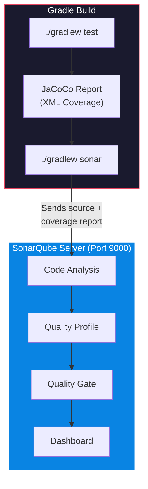

**SonarQube configuration in `build.gradle`:**
```groovy
sonar {
    properties {
        property "sonar.projectKey", "inventory-management-system"
        property "sonar.projectName", "Inventory Management System"
        property "sonar.qualitygate.wait", "false"
    }
}
```

**SonarQube credentials in `gradle.properties`:**
```properties
systemProp.sonar.login=admin
systemProp.sonar.password=Welcome@1
systemProp.sonar.host.url=http://localhost:9000
```

> **In Jenkins**, the SonarQube URL is overridden to `http://sonarqube:9000` (Docker service name) via the `withSonarQubeEnv` step.

---

### Pipeline Setup Guide

#### Step 1: Start Infrastructure

```bash
docker-compose up -d
```
This starts both Jenkins (port 8080) and SonarQube (port 9000).

#### Step 2: Configure SonarQube

1. Open `http://localhost:9000`
2. Login with default credentials: `admin` / `admin`
3. Change password (e.g., to `Welcome@1`)
4. Go to **Administration → Security → Users → Tokens**
5. Generate a token and copy it

#### Step 3: Configure Jenkins

1. Open `http://localhost:8080`
2. Complete initial Jenkins setup wizard
3. Install required plugins:
   - **SonarQube Scanner**
   - **Pipeline**
   - **Git**
4. Configure SonarQube in Jenkins:
   - Go to **Manage Jenkins → System → SonarQube servers**
   - Name: `SonarQube`
   - Server URL: `http://sonarqube:9000`
   - Add authentication token from Step 2
5. Configure SonarQube Webhook (for Quality Gate):
   - In SonarQube, go to **Administration → Webhooks**
   - Add webhook URL: `http://jenkins:8080/sonarqube-webhook/`

#### Step 4: Create Pipeline Job

1. In Jenkins, click **New Item → Pipeline**
2. Under **Pipeline**, select **Pipeline script from SCM**
3. Enter your Git repository URL
4. The `Jenkinsfile` in the root will be auto-detected

#### Step 5: Run the Pipeline

Click **Build Now** — the pipeline will checkout, build, test, analyze, and enforce quality gates automatically.

---

## 🧪 Testing

The project has **24 test files** across all layers with **95%+ code coverage**.

### Test Categories

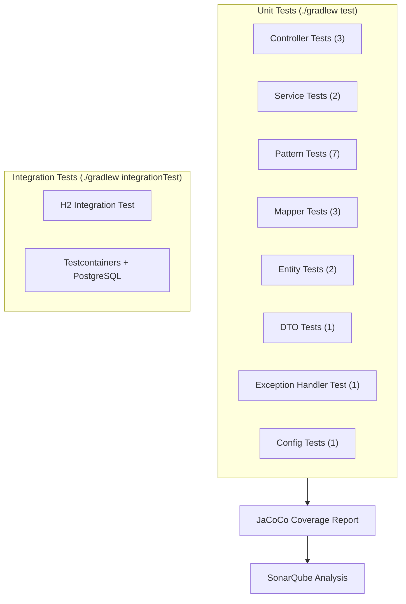

### Test Files

| Layer | Tests | Description |
|-------|-------|-------------|
| **Controllers** | `ProductControllerTest`, `CategoryControllerTest`, `InventoryControllerTest` | MockMvc-based REST endpoint tests |
| **Services** | `ProductServiceTest`, `CategoryServiceTest` | Service logic with mocked repositories |
| **Patterns** | `StockInCommandTest`, `StockOutCommandTest`, `StockRepositoryContextTest`, `InventoryFacadeTest`, `StockOperationFactoryTest`, `StockLevelMonitorTest`, `EmailAlertStrategyTest`, `StrategyCoverageTest` | Design pattern implementation tests |
| **Mappers** | `ProductMapperTest`, `CategoryMapperTest`, `MapperCoverageTest` | MapStruct mapping verification |
| **Entities** | `EntityCoverageTest`, `StockTest` | Entity behavior and coverage |
| **Integration** | `InventoryH2IntegrationTest`, `InventoryIntegrationTest` | Full-stack tests with real databases |

### Running Tests

```bash
# Run unit tests only
./gradlew test

# Run integration tests only
./gradlew integrationTest

# Run all tests
./gradlew test integrationTest

# Generate coverage report
./gradlew test jacocoTestReport
# Report: build/reports/jacoco/test/html/index.html

# Run SonarQube analysis
./gradlew test jacocoTestReport sonar
```

---

## 🚀 Getting Started

### Prerequisites

- **Java 17** or higher
- **Docker** and **Docker Compose** (for CI/CD infrastructure)

### Quick Start

```bash
# 1. Clone the repository
git clone <repository-url>
cd inventory-management-system

# 2. Run the application
./gradlew bootRun

# 3. Application is running at:
#    http://localhost:8081

# 4. Access H2 Console:
#    http://localhost:8081/h2-console
#    JDBC URL: jdbc:h2:mem:inventorydb
#    Username: sa | Password: password
```

### Testing the API

A **Postman collection** is included: `inventory_system.postman_collection.json`

Import it into Postman and set the `baseUrl` variable to `http://localhost:8081`.

**Quick test flow:**
```bash
# 1. Create a category
curl -X POST http://localhost:8081/api/categories \
  -H "Content-Type: application/json" \
  -d '{"name": "Electronics", "description": "Devices and gadgets"}'

# 2. Create a product
curl -X POST http://localhost:8081/api/products \
  -H "Content-Type: application/json" \
  -d '{"name": "Laptop", "sku": "LAP-001", "price": 1500.00, "lowStockThreshold": 10, "categoryId": 1}'

# 3. Stock In (add 50 units)
curl -X POST http://localhost:8081/api/inventory/operate \
  -H "Content-Type: application/json" \
  -d '{"productId": 1, "warehouseId": 1, "quantity": 50, "type": "IN", "reason": "Initial stock"}'

# 4. Stock Out (remove 5 units)
curl -X POST http://localhost:8081/api/inventory/operate \
  -H "Content-Type: application/json" \
  -d '{"productId": 1, "warehouseId": 1, "quantity": 5, "type": "OUT", "reason": "Customer order"}'
```

---

## 📊 Project Stats

| Metric | Value |
|--------|-------|
| **Source Files** | 30+ Java files |
| **Test Files** | 24 test classes |
| **Code Coverage** | 95%+ |
| **Design Patterns** | 5 (Factory, Command, Facade, Observer, Strategy) |
| **REST Endpoints** | 6 |
| **Entities** | 6 + 1 base entity |
| **CI/CD Stages** | 6-stage Jenkins pipeline |
| **Docker Services** | Jenkins + SonarQube |

---

<p align="center">
  <b>Built with ❤️ using Spring Boot, Clean Architecture, and Design Patterns</b>
</p>
